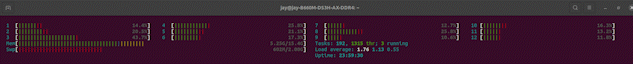
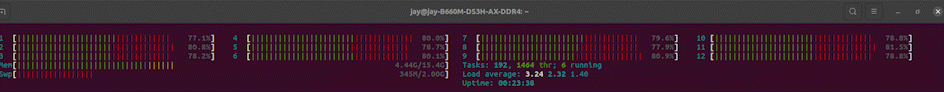
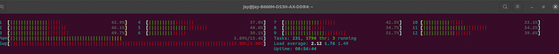

# Multi thread Test.
When we use multi thread with light-load. It will run in the same core.  
  
When we use multi thread with power-load. It will run in the different core.  
  

# Multi process Test.
When we run multi process , memory might be overload!

# Difference between multi thread and multi process.

|               | Multi thread              | Multi process                         |
| ------------- |:-------------------------:|:-------------------------------------:|
| Memory        | share the same memory.    |Every process has is own memory space. |
| apply to      | IO-bound task.            |CPU-bound task.                        |

